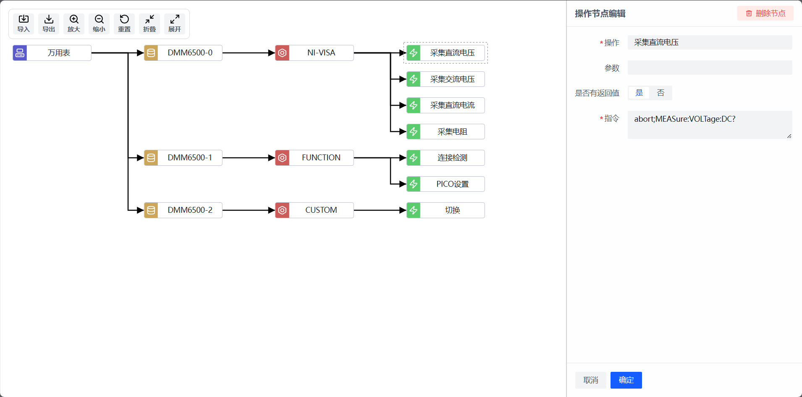

# PROFILE-EDITOR

基于 Vue3 + [LogicFlow](https://github.com/didi/LogicFlow) 实现的仪器配置文件编辑器。



## 本地开发

```bash
# 安装依赖
npm install

# 启动本地服务
npm run dev
```

## 物料来源

| 物料 | 来源 |
| --- | --- |
| Icon | [Lucide](https://lucide.dev/) |
| 组件库 | [Arco Vue](https://arco.design/vue/docs/start) |
